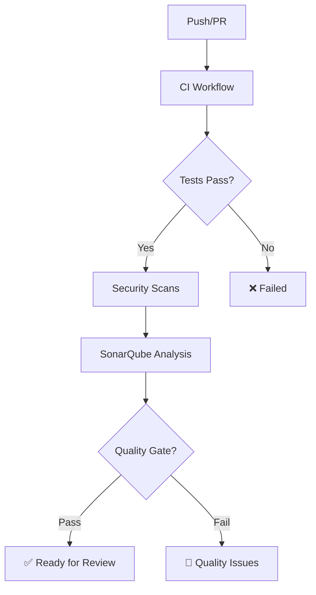

# GitHub Actions Workflows

Este proyecto utiliza GitHub Actions para implementar un pipeline completo de CI/CD con las siguientes características de seguridad:

## 🚀 Workflows Configurados

### 1. CI (Integración Continua) - `ci.yml`

**Trigger**: Pull requests y push a main

- ✅ **Lint & Format**: ESLint y Prettier
- 🧪 **Unit Tests**: Vitest con cobertura de código
- 🎭 **E2E Tests**: Playwright en múltiples navegadores
- 🏗️ **Build**: Construcción del proyecto Astro

### 2. SonarQube Analysis - `sonarqube.yml`

**Trigger**: Push a main y pull requests

- 📈 **Quality Analysis**: Análisis de calidad de código
- 🧪 **Test Coverage**: Integración con reportes de cobertura
- 🔍 **Security Scan**: Detección de vulnerabilidades
- 📊 **Reports**: Subida de reportes a SonarQube (https://sonar.ingenial.co)

### 3. Security & Dependencies - `security.yml`

**Trigger**: Semanal, push y pull requests

- 🔒 **Security Audit**: Auditoría de dependencias
- 🤖 **CodeQL**: Análisis estático de seguridad
- 🕵️ **Secret Scanning**: Detección de secretos con TruffleHog

## 🔧 Configuración Requerida

### Secrets de GitHub (IMPORTANTE)

Configure estos secrets en su repositorio (Settings → Secrets):

| Secret Name      | Description                      | Required |
| ---------------- | -------------------------------- | -------- |
| `SONAR_TOKEN`    | Token de SonarQube para análisis | ✅ Yes   |
| `SONAR_HOST_URL` | URL del servidor SonarQube       | ✅ Yes   |

**⚠️ NUNCA hardcodee tokens o URLs en el código**

### Valores de los Secrets:

- `SONAR_TOKEN`: Tu token de acceso personal de SonarQube
- `SONAR_HOST_URL`: `https://sonar.ingenial.co`

### Cómo obtener SONAR_TOKEN:

1. Visita: https://sonar.ingenial.co/account/security
2. Genera un nuevo token con permisos "Analyze"
3. Copia el token inmediatamente
4. Añádelo como secret en GitHub

## 📊 Flujo de Trabajo Seguro

## 🛡️ Características de Seguridad

### Análisis Automatizado

- **CodeQL**: Detección de vulnerabilidades en código
- **Dependency Audit**: Vulnerabilidades en dependencias
- **Secret Scanning**: Prevención de secrets expuestos
- **Quality Gates**: Estándares de calidad obligatorios

### Protección de Branches

- **Main Branch**: Protegido, requiere PR y reviews
- **Status Checks**: Todos los workflows deben pasar
- **Force Push**: Bloqueado en main

### Gestión de Secrets

- **GitHub Secrets**: Para tokens y credenciales
- **Environment Variables**: Para configuración local
- **Nunca en código**: Cero tolerancia a secrets hardcodeados

## 🚨 Manejo de Incidentes

Si se detecta un secret expuesto:

1. **Automático**: TruffleHog bloquea el push/PR
2. **Manual**: Sigue las guías en [SECURITY.md](../SECURITY.md)
3. **Rotación**: Rota inmediatamente el secret comprometido

## 📈 Métricas de Calidad

Monitoreamos estas métricas en SonarQube:

- **Code Coverage**: Mínimo 80%
- **Bugs**: 0 tolerance
- **Vulnerabilities**: 0 tolerance
- **Code Smells**: Minimizar
- **Duplicated Code**: < 3%

## 🔄 Mantenimiento

- **Diario**: Análisis de PRs
- **Semanal**: Security audits
- **Mensual**: Dependency updates
- **Continuo**: Monitoring de calidad

## 📚 Documentación Adicional

- [Security Guidelines](../SECURITY.md)
- [SonarQube Setup](../sonar-setup.md)
- [Environment Variables](.env.example)
